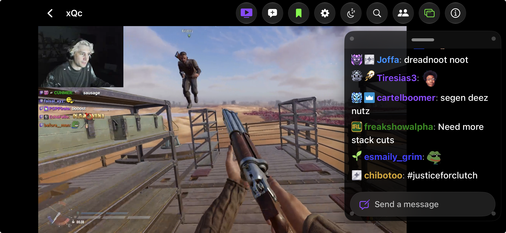

# Twick

**The ultimate multi-platform live stream companion and chat viewer for iOS.**

  

The official Twitch and Kick mobile apps don't support popular chat extensions like 7TV, BetterTTV (BTTV), and FrankerFaceZ (FFZ). Millions of viewers are stuck reading text codes instead of seeing actual emotes. 

Twick fixes this. See chat exactly how it was meant to look, while watching your favorite Twitch and Kick creators in one seamless app.

  

---

## Features

### Third-Party Emotes & Badges
Stop reading text codes and start seeing the emotes.
* Automatically load 7TV, BetterTTV, and FrankerFaceZ emotes and badges in every chat.
* Use the autocomplete menu to quickly find and send emotes while typing.
* Background retry logic ensures emotes load smoothly even on spotty cellular connections.

### Multi-Platform & Combined Chat
Keep all your favorite streams and accounts in one place.

  

* Link your Twitch and Kick accounts to chat, or just watch anonymously.
* **Combined Mode:** Merge Twitch and Kick chats into a single, unified feed for creators who stream on both platforms.
* Tap reply threads to easily follow conversations between moderators and viewers.

### Floating Chat & Multitasking
Watch your way, without chat getting in the way.

  

* Drag and drop a transparent, floating chat window anywhere over the video player.
* Multitask outside the app with full Picture-in-Picture support.
* Add Live Home Screen widgets to see who is streaming without opening the app.

### Chat Customization
Change the look and layout of chat to fit your eyes and your screen.

  

* Use sliders to adjust font size, line spacing, badge scale, and emote size.
* See your changes update instantly in a live preview box.
* Personalize chat with toggles for rainbow usernames, line dividers, and timestamps.

### CarPlay & Background Audio
Take streams on the road safely.

  

* Listen to live streams with an official Apple CarPlay interface.
* Browse your followed list, check live categories, and manage playback from your car's dashboard.
* Save battery by playing stream audio in the background while your phone is locked.

---

## App Comparison

Twick combines the best parts of mobile streaming into one unified experience.

| Features | **Twick** | Twitch App | Kick App | Chatsen | Frosty |
| :--- | :---: | :---: | :---: | :---: | :---: |
| **Twitch Support** | Yes | Yes | No | Yes | Yes |
| **Kick Support** | Yes | No | Yes | No | No |
| **Combined Chat Mode** | Yes | No | No | No | No |
| **7TV, BTTV, FFZ Emotes** | Yes | No | No | Yes | Yes |
| **Floating Chat Window** | Yes | No | No | No | No |
| **Apple CarPlay App** | Yes | No | No | No | No |
| **Live Home Widgets** | Yes | Yes | No | No | No |
| **Picture-in-Picture** | Yes | Yes | Yes | No | Yes |

---

## Quick Setup

1. Download Twick from the Apple App Store.
2. Search for your favorite creators and save them to your dashboard.
3. Securely link your Twitch or Kick accounts to join the chat.

**Compatibility:** Requires an iPhone or iPad running iOS 18.0 or newer.

---

## Twick Pro

Support independent development and unlock premium features:
* Save as many channels as you want and switch between them instantly.
* Automatically load recent chat history when you join a room so you never miss the context.
* Sync your saved channels, settings, and accounts across all your Apple devices via iCloud.
* Unlock custom app color themes and sync chat delay timers to perfectly match video latency.

## Privacy & Security

* Twick connects directly to the official Twitch and Kick servers from your device.
* We do not use intermediary tracking servers. Your messages, logins, and viewing habits are never stored or shared by us.

## Support & Feedback

* **Discord Community:** [Join our official Discord server](https://discord.gg/czrTkKvn26) to request features, report bugs, and chat with other users.
* **Send Feedback:** Go to Settings → Send Feedback directly inside the app to get in touch.

---
Built with care by Shubham Shah. All rights reserved. Proprietary software.
