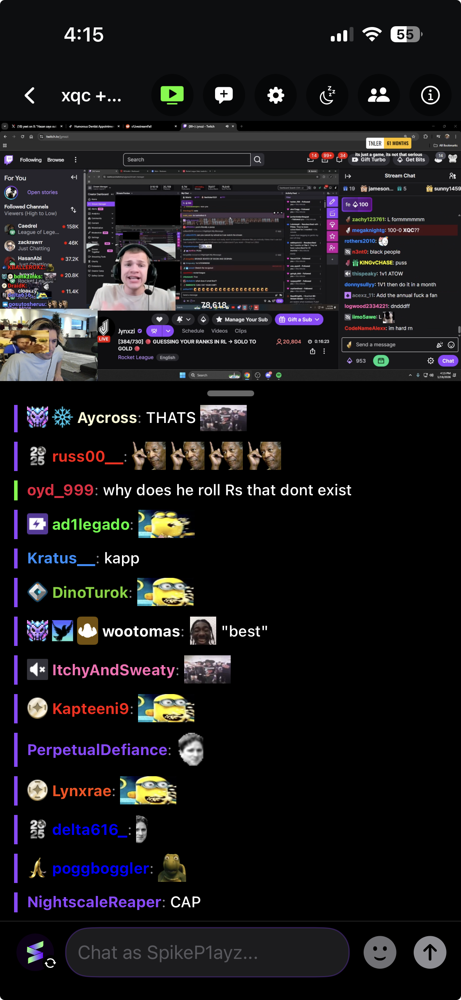

# Twick

**The ultimate multi-platform live stream companion and chat viewer for iOS.**

  

The official Twitch and Kick mobile apps do not support popular community extensions like 7TV, BetterTTV (BTTV), and FrankerFaceZ (FFZ). Millions of mobile viewers are left looking at plain text codes instead of the actual emotes that make chat readable.

Twick fixes this by bringing third-party emotes and badges directly to your device, alongside a seamless video viewing experience for both platforms.

  

---

## Features

### Third-Party Emotes & Badges
Stop reading text codes and see chat exactly how it was meant to look.
* Load all global and channel emotes from 7TV, BetterTTV, and FrankerFaceZ straight into your chat feed.
* Pull up a quick-access menu with autocomplete while typing to find and insert emotes instantly.
* Emote image requests automatically retry in the background to handle drops in cellular coverage seamlessly.

### Multi-Platform Chat Modes
Watch your favorite creators and link your streaming accounts in one clean interface.

  

* Watch Twitch and Kick chats side-by-side or combined into a single chronological feed.
* Tap reply threads to view original messages and follow moderator conversations without losing your place.
* Manage multiple platform profiles with active alerts that let you know if your login token needs to be refreshed.

### Chat Customization & Real-Time Preview
Change the look and layout of your chat rooms to fit your eyes and your screen.

  

* Use fluid sliders to adjust the core font size, line spacing, user badges, and emote dimensions.
* Personalize your layout with toggles for rainbow usernames, message line dividers, and exact timestamps.
* See your formatting changes update instantly in a live preview box before saving them.

### Video Player, Background Audio & CarPlay
Keep up with the stream using a media engine built for multitasking and travel.

  

* Multitask effortlessly with Picture-in-Picture, full-screen theater modes, and Live Home Screen widgets.
* Listen to live streams on the road with an official Apple CarPlay audio app layout.
* Browse your followed list, pick video categories, and pause stream audio directly from your vehicle's dashboard.

---

## Ecosystem Comparison

Unlike standalone wrappers, Twick aggregates platform chat structures and custom extension layers into a fast, unified dashboard environment. 

| Feature Matrix | **Twick** | Twitch App | Kick App | Chatsen | Frosty |
| :--- | :---: | :---: | :---: | :---: | :---: |
| **Twitch Integration** | Yes | Yes | No | Yes | Yes |
| **Kick Integration** | Yes | No | Yes | No | No |
| **Combined Chat Mode** | Yes | No | No | No | No |
| **7TV, BTTV, FFZ Emotes** | Yes | No | No | Yes | Yes |
| **Apple CarPlay App** | Yes | No | No | No | No |
| **Live Home Widgets** | Yes | Yes | No | No | No |
| **Picture-in-Picture** | Yes | Yes | Yes | No | Yes |
| **Universal iCloud Sync** | Yes | No | No | No | No |

---

## Core Workflows

* Keep up with dual-streamed broadcasts without bouncing back and forth between different apps.
* Listen to live streams or community events safely while driving using clean vehicle controls.
* Scale up tiny, fast-moving text into high-visibility layouts that reduce eye strain during long viewings.

**Device Compatibility:** Requires an iPhone or iPad running iOS 18.0 or newer.

---

## Twick Pro Upgrade

Support independent development and unlock advanced premium features:
* Save as many channels as you want and switch between them instantly.
* Load recent chat history automatically when you join a room so you never miss the context.
* Sync your saved channels, layout preferences, and accounts across all your Apple devices via iCloud.
* Unlock custom app color themes and sync chat delay timers to perfectly match live video latency.

## Privacy & Security

* Twick connects directly to the official Twitch and Kick servers from your device.
* The app runs entirely without an intermediary tracking server. Your messages, logins, and viewing habits are never stored or shared by us.

## Support & Feedback

* **Discord Community:** [Join our official Discord server](https://discord.gg/czrTkKvn26) to request features, report bugs, and chat with other users.
* **Send Feedback:** Go to Settings → Send Feedback directly inside the app to get in touch.

---
Built with care by Shubham Shah. All rights reserved. Proprietary software.
