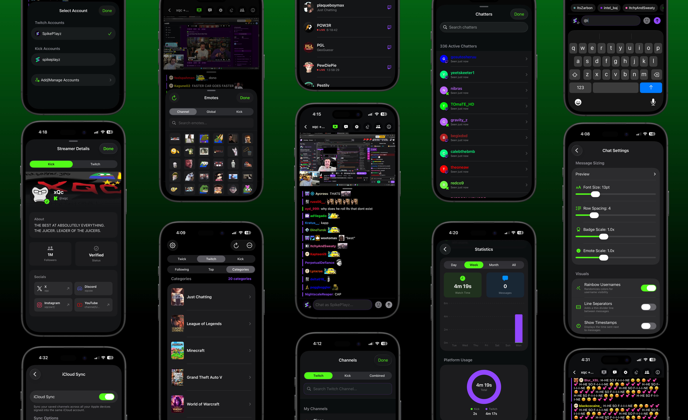
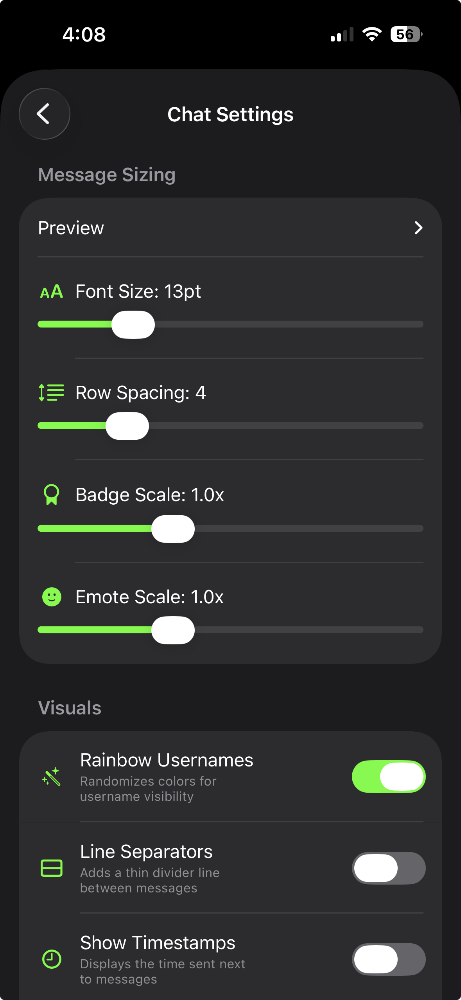
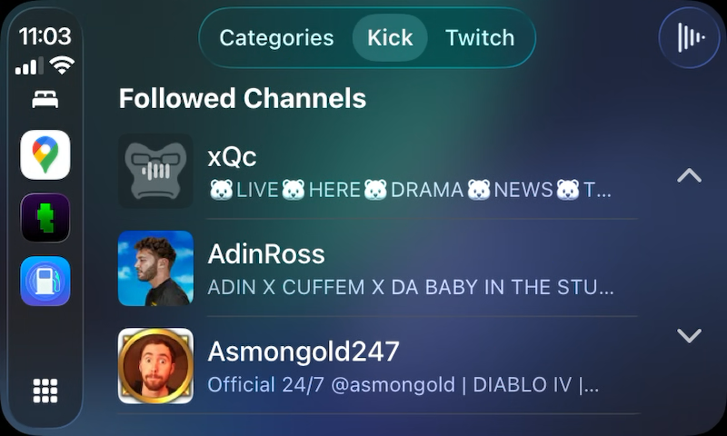

# Twick

**The ultimate multi-platform live stream companion and chat viewer for iOS.**

  <a href="https://apps.apple.com/us/app/twick-chat-for-kick-twitch/id6755964690">
    

The official Twitch and Kick mobile applications leave community spaces feeling fragmented, completely lacking native support for popular chat extensions like 7TV, BetterTTV (BTTV), and FrankerFaceZ (FFZ). Millions of viewers are left looking at unrendered plain text tags instead of actual community expressions.

**Twick bridges the gap** by delivering deep third-party emote integration alongside a beautiful, seamless viewing experience across both platforms simultaneously.

  

---

## Features

### Comprehensive Emote Integration
Stop reading plain-text extension tags and view chats the way they were intended to look.
* **Full Extension Aggregation:** Immersive processing for 7TV, BetterTTV, and FrankerFaceZ visual nodes layers directly into the native chat flow.
* **Smart Content Auto-Discovery:** Access all global and channel-specific emote slots seamlessly with built-in asset mapping.
* **Intelligent Autocomplete:** Tap active text fields to pull up fast, inline autocomplete listings for immediate selection while typing.

### Granular Display Adjustments
Tailor your readability preferences exactly to your screen environment with real-time feedback panels.

  

* **Flexible Sizing Configurations:** Adjust primary font sizing metrics, custom line spacing rows, creator loyalty badge sizes, and independent emote rendering scales.
* **Visual Clarity Enhancements:** Toggle on unique look choices like rainbow username sorting, distinct message dividers, and precise message timestamps.
* **Immediate System Previews:** Audit text weight or sizing revisions instantly in the settings window before shifting back into active streams.

### Dedicated CarPlay Audio Companion
Take your live communities with you on your commute using media architectures engineered specifically for the road.

  

* **Native Vehicle Coordination:** Browse your followed feeds, track live categories, and review room info cleanly using a customized CarPlay interface.
* **Uninterrupted Background Audio:** Transition live video rooms effortlessly into background sound feeds optimized to manage resource boundaries during travel.
* **Hardware Remote Control:** Shift paths, manage audio playback pauses, and review announcer text strings straight from dashboard panel controls.

### Consolidated Feed Control
Organize disparate platform accounts inside a singular, high-performance profile setup.

  

* **Platform Synchronization:** Manage, track, and reorder distinct stream entries across separate services inside a single master channel view.
* **Announcements & Pins:** Never miss essential broadcast shifts with top-anchored banner modules that display pinned comments and moderation tags.
* **Immersive Multitasking Player:** Track action grids continuously using responsive Picture-in-Picture windows, dedicated full-screen theater modes, and lock-screen progress widgets.

---

## Core Workflows

* **Unified Stream Monitoring:** Observe cross-broadcast rooms simultaneously without maintaining independent applications or managing multiple web browser sheets.
* **Automated Audio Transit:** Listen to community debates or live coverage safely on the road using intuitive dashboard layouts built for travel.
* **Personalized Accessibility Mapping:** Customize microscopic chat room feeds into high-visibility layouts that reduce eye strain during extended viewing sessions.

## Quick Start

1. Download **Twick** through the [Apple App Store](https://apps.apple.com/us/app/twick-chat-for-kick-twitch/id6755964690).
2. Save your preferred live profiles onto your centralized dashboard view.
3. Link your provider profiles securely to join the room discussion, or track active live chats anonymously in a read-only configuration.

**Device Compatibility:** Optimized for iPhone and iPad setups running iOS 14.0 or newer.

## Twick Pro Upgrade

Support independent development and unlock elite performance customizations through flexible premium options:
* **Limitless Feed Slots:** Remove all interface caps to monitor and jump between unlimited saved channels instantly.
* **Historical Context Catch-Up:** Pull in cached chat histories immediately when entering any channel to understand the conversation before you type.
* **Advanced Synchronization:** Access customized theme matching options, precise stream delay offset balancing, and universal iCloud setting backups across multiple screens.

## Privacy & Security Ideals

* **Direct-to-Platform Connections:** Twick establishes direct network paths exclusively between your terminal and the official streaming provider servers.
* **Zero Intermediary Collection Backends:** The application runs fully without logging messages, saving inputs, or utilizing an external intermediary tracking server. Your data stays entirely yours.

## Support Channels

* **Community Hub:** [Join our official Discord server](https://discord.gg/czrTkKvn26) to log issues, suggest custom layout features, and discuss new updates.
* **Direct Feedback Line:** Tap Settings → Send Feedback inside the application interface to submit performance metrics directly to the development pipeline.

---
Built with care by **Shubham Shah**. All rights reserved. Proprietary application structure.
